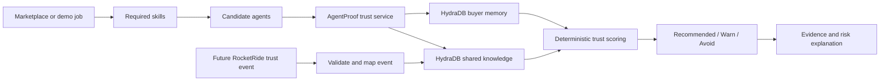

# AgentProof: Project and HydraDB Implementation Overview

## 1. Executive summary

AgentProof is a trust and reputation layer for marketplaces where buyers hire
AI agents or automated workers. Ordinary marketplace ratings answer a broad
question—"Was this agent generally well rated?"—but they do not reliably answer
the hiring question that matters:

> Which agent is safest for this exact task, required skill set, buyer, and
> risk tolerance?

AgentProof decomposes jobs into skills and records evidence at the
`agent × skill × task context` level. It distinguishes an agent's claimed
capabilities from verified delivery history, recent failures, disputes,
refunds, late work, and repeat hires. Buyer preferences are also part of the
decision: a risk-averse buyer and a price-sensitive buyer can receive different
recommendations for the same task.

HydraDB is the persistence and retrieval layer for this trust system. It stores
shared skills, agent profiles, skill claims, and trust events as knowledge. It
stores each buyer's preferences as buyer-scoped memory. AgentProof combines
HydraDB retrieval with deterministic, inspectable scoring to produce
recommended, warning, and avoid lists with evidence.

RocketRide is a separate workstream. Its future role is to turn raw job/runtime
activity into a validated AgentProof trust event. No RocketRide implementation
is included in the HydraDB work described here.

## 2. Problem AgentProof solves

### Global ratings hide skill-level risk

An agent can have a 4.9 global rating and still be unsafe for a specific task.
For example, the agent may perform well on individual PDFs but have recent
failures on 500-file batch extraction, schema mapping, or validation. A global
average hides that distinction.

### Claims are not evidence

Marketplace profiles normally list what an agent says it can do. AgentProof
stores those claims, but keeps them separate from verified trust history. A
claim helps discover candidates; it does not automatically increase the trust
score as if it were successful delivery evidence.

### Recent incidents matter differently by buyer

A recent failed batch, partial refund, or dispute matters more to a risk-averse
buyer than to a buyer optimizing primarily for price. AgentProof therefore
models buyer preferences instead of returning one universal ranking.

### Trust must change after new work

The system is designed so a newly ingested trust event changes later hiring
recommendations. The future RocketRide integration supplies these structured
events; the implemented HydraDB boundary validates, maps, ingests, and indexes
them.

## 3. High-level architecture



The recommendation path has two complementary parts:

1. Deterministic scoring calculates an auditable ranking from structured agent,
   buyer, and trust-event data.
2. HydraDB retrieval supplies ranked knowledge and personalized memory context,
   and grounds the returned recommendation in retrieved trust-event IDs.

This design avoids asking a language model to invent a trust score. The score
and classification remain inspectable, while HydraDB provides relevant evidence
and personalization.

## 4. HydraDB API v2 integration

The implementation uses raw HydraDB API v2 through a small dependency-free
TypeScript adapter.

Every live request uses:

- `Authorization: Bearer <HYDRA_DB_API_KEY>`
- `API-Version: 2`
- The HydraDB response envelope: `{ success, data, error, meta }`
- `meta.request_id` in surfaced failures when HydraDB provides one

Implemented endpoints:

| Purpose | Method and endpoint |
|---|---|
| Create database | `POST /databases` |
| Check readiness | `GET /databases/status` |
| Ingest knowledge or memory | `POST /context/ingest` |
| Poll indexing | `GET /context/status` |
| Query knowledge, memory, or both | `POST /query` |
| Browse stored context | `POST /context/list` |
| Delete context records | `DELETE /context` |
| List collections | `GET /databases/collections` |
| Inspect database counts | `GET /databases/stats` |

Only HTTP `429`, `500`, and `503` responses are retried. Retries use bounded
exponential backoff with jitter. Validation, authorization, not-found, and
conflict errors are not retried.

## 5. Configuration and safe execution

HydraDB is disabled by default. Live calls require all three values:

```text
HYDRA_DB_ENABLED=true
HYDRA_DB_API_KEY=<secret>
HYDRA_DB_DATABASE_ID=<database>
```

The repository `.env` contains the credentials locally and must not be
committed. Tests inject a mock `fetch` transport, so tests, typechecking, and
builds do not require HydraDB credentials or internet access.

The configured live database used during verification was `default-tenant`.

## 6. HydraDB data model

### Shared knowledge collection

Skills, agent profiles, skill claims, and trust events are stored in
`collection=default`. These records must be shared because trust evidence from
one buyer should inform later hiring decisions made by other buyers.

| Knowledge type | Records | Stable ID pattern |
|---|---:|---|
| Skill definitions | 8 | `skill_<skill_id>` |
| Agent profiles | 4 | `agent_<agent_id>` |
| Agent-skill claims | 18 | `agent_skill_claim_<agent_id>_<skill_id>` |
| Skill-level trust events | 16 | Existing `trust_event_id` |
| **Total shared knowledge** | **46** | — |

Every knowledge record uses the v2 app-knowledge structure:

```text
id
database
collection
title
type
timestamp
content.text
tenant_metadata
additional_metadata
```

Stable IDs and `upsert=true` make repeated seed ingestion idempotent.

### Buyer memory collections

Buyer preferences are stored as memories in `collection=<buyer_id>` with
`infer=true`.

Implemented buyer collections:

- `buyer_balanced`
- `buyer_sla_critical`
- `buyer_risk_averse`
- `buyer_price_sensitive`

Four buyer preference inputs were ingested. The live HydraDB instance produced
two inferred memory rows per buyer, for eight stored memory rows in total.

### Filterable tenant metadata

The database schema declares these exact-match fields before ingestion:

```text
skill_id
agent_id
buyer_id
task_category
outcome
edge_type
price_tier
risk_level
complexity
sla_level
dispute_status
arbitration_outcome
```

Frequently filtered values go in `tenant_metadata`. Free-form details such as
ratings, descriptions, failure modes, verification notes, job IDs, and source
bookkeeping go in `additional_metadata`.

## 7. Seed datasets

The canonical offline datasets are:

- `data/seed/skills.json`
- `data/seed/agents.json`
- `data/seed/agent-skill-claims.json`
- `data/seed/trust-events.json`
- `data/seed/buyer-preferences.json`

They cover:

- Skills and skill dependencies
- Agent profiles and price/verification attributes
- Explicit claimed-skill records
- Passed and failed skill execution
- Repeat hires
- Late delivery
- Disputes and arbitration outcomes
- Partial refunds
- Buyer risk, price, verification, and SLA preferences

## 8. Trust-event validation and ingestion

The trust service performs strict runtime validation before ingestion. It
requires every field from the shared `TrustEvent` contract, rejects unknown
fields, validates enumerations and rating bounds, requires RFC3339 timestamps,
and requires `additional_context` to be an object.

A valid trust event becomes HydraDB knowledge with:

- Stable ID equal to `trust_event_id`
- Shared collection `default`
- Searchable text summarizing outcome, skill, agent, and reason
- Filterable skill, agent, buyer, outcome, edge, risk, SLA, and dispute fields
- Free-form job, rating, timestamp, source, and additional context

After ingestion, AgentProof polls `/context/status`. Both `graph_creation` and
`completed` are accepted as searchable states. `errored` and `failed` are
terminal failures and are surfaced to the caller.

## 9. Reference-data ingestion

Skills, agents, and claims are mapped separately and uploaded as three coherent
batches. This preserves the conceptual distinction:

```text
Skills = capabilities that exist
Agents = workers that claim capabilities
Claims = assertions that connect agents to skills
Trust events = evidence that a skill was actually executed well or poorly
```

Each batch is indexed and polled before the live verification proceeds.

## 10. Recommendation logic

### Deterministic scoring

Each candidate receives an inspectable score composed of:

- Global rating
- Skill-specific evidence
- Recency
- Repeat hires
- Verification and SLA fit
- Price fit
- Incident penalties

Recent evidence receives more weight than old evidence. Failed work, disputes,
refunds, and late delivery introduce buyer-sensitive penalties. The buyer's
risk aversion, verification requirement, price sensitivity, and SLA priority
alter the result.

Candidates are classified as:

- `recommended`
- `warn`
- `avoid`

The canonical demo proves that Agent B outranks higher-rated Agent A for a
500-PDF extraction job because Agent A has recent task-relevant failure and
refund evidence.

### HydraDB-grounded evidence

Live behavior showed that a buyer-scoped `type=all` query returned buyer memory
but did not expose knowledge stored in `default`. The service therefore uses
two explicit retrieval lanes:

1. `type=knowledge`, `collection=default` for shared skill, agent, claim, and
   trust-event evidence.
2. `type=all`, `collection=<buyer_id>` for personalized buyer context.

Server order is preserved inside each lane. Shared knowledge results are used
to match real trust-event IDs. Only validated local trust events with valid
timestamps become evidence in the shared recommendation contract. Unknown or
unmatched HydraDB source IDs are reported in HydraDB-owned retrieval diagnostics
instead of being invented as evidence.

The original synchronous deterministic `recommend()` remains available for
offline use. `recommendWithHydraEvidence()` provides the live grounded path and
surfaces failures from either HydraDB query lane.

## 11. Live verification evidence

The completed live flow verified:

```text
Database ready: true
Skills ingested: 8
Agents ingested: 4
Claims ingested: 18
Trust events ingested: 16
Buyer preference inputs ingested: 4
```

Live retrieval returned non-empty results for:

- Relevant skills
- Agent skill claims
- Skill-specific failures
- Buyer memory
- Personalized `type=all` retrieval

The final live grounded recommendation returned:

```text
Best agent: agent_b
Shared knowledge chunks: 10
Personalized chunks: 2
Matched trust-event IDs: 3
Contract evidence records: 3
```

The database stats endpoint reported:

```text
Knowledge rows: 46
Memory rows: 8
```

All 46 knowledge records reported indexing status `completed`.

## 12. Why the dashboard graph may show only a few nodes

HydraDB context records and graph nodes are not the same measurement.

- Context records are the stored knowledge and memory sources.
- Graph nodes are entities and relations extracted or explicitly supplied for
  graph traversal.

AgentProof intentionally avoided inventing relations to IDs that did not exist
as HydraDB context sources. As a result, the current graph can be sparse even
while all 46 knowledge records are indexed and searchable. Hybrid/vector
retrieval and deterministic scoring do not require a large graph.

To inspect knowledge in the dashboard:

1. Select database `default-tenant`.
2. Select collection `default`.
3. Select Knowledge, Documents, or All.
4. Clear application/source filters.
5. Refresh or reselect the database if the view is cached.

To inspect buyer memory, select the relevant buyer collection and choose the
Memory view. HydraDB's context-list API currently labels the stored shared
app-knowledge records as `document`, so a dashboard filter limited to another
source type can appear empty.

Now that stable skill and agent context records exist, explicit relations could
be added later as an optional HydraDB graph enhancement. That is not required
for the current recommendation flow.

## 13. Source-code map

| Area | File |
|---|---|
| HydraDB v2 adapter | `src/server/hydradb/client.ts` |
| Adapter tests | `src/server/hydradb/client.test.mjs` |
| Validation, mappings, ingestion, recommendation service | `src/server/trust/service.ts` |
| Trust-service tests | `src/server/trust/service.test.mjs` |
| Deterministic scoring | `src/lib/trust/scoring.ts` |
| HydraDB-specific types | `src/types/hydradb.ts` |
| Live seed, migration, and query verification | `hydradb/live-smoke.mjs` |
| Planned metadata schema | `hydradb/seed/tenant-metadata-schema.json` |
| Operational notes | `hydradb/README.md` |

## 14. Tests and operating commands

Offline focused tests:

```sh
node --experimental-strip-types --test \
  src/server/hydradb/client.test.mjs \
  src/server/trust/service.test.mjs
```

Typecheck and build:

```sh
npm run typecheck
npm run build
```

Credential-enabled live verification:

```sh
HYDRA_DB_ENABLED=true \
node --env-file=.env --experimental-strip-types hydradb/live-smoke.mjs
```

The current focused suite contains 11 passing tests. The production build and
TypeScript checks pass.

## 15. HydraDB migration history

During implementation, two incorrectly scoped seed layouts were removed:

1. Legacy records created through deprecated HydraDB endpoints.
2. Trust events placed inside buyer collections by an earlier adapter version.

The canonical 16 trust events were then re-ingested into `collection=default`.
This was a scope migration, not deletion of the trust corpus. Buyer memories
were never targeted by trust-event cleanup. Stable IDs and upserts prevent
duplicate seed records on later live runs.

## 16. Future RocketRide integration boundary

RocketRide remains independently owned. The completed HydraDB boundary expects
a value matching the shared `TrustEvent` contract. Future integration should:

1. Receive a RocketRide-produced trust event.
2. Call the existing strict validation and ingestion service.
3. Wait for HydraDB indexing.
4. Request a later recommendation and demonstrate that the new event changes
   the result where relevant.

The HydraDB implementation does not need RocketRide internals. Integration can
occur through a backend endpoint/function or, as a fallback, a shared JSON
file. No RocketRide files need to be modified by the HydraDB owner.

## 17. Merge and ownership guidance

The HydraDB working tree is confined to:

- `hydradb/`
- `src/server/hydradb/`
- `src/server/trust/`
- `src/lib/trust/`
- `src/types/hydradb.ts`
- `data/seed/`

It does not modify RocketRide-owned paths, shared contracts, or frontend/app
boilerplate. A RocketRide branch that follows the ownership plan should merge
without a textual conflict. Conflicts become possible only if the RocketRide
branch also changes the HydraDB-owned files above, or if both branches modify
the same shared file such as `package.json`, a shared contract, or an app route.

Before merging, compare both branches with:

```sh
git diff --name-only main...<rocketride-branch>
```

If the RocketRide changes remain in their assigned paths, the expected merge
risk is low.
